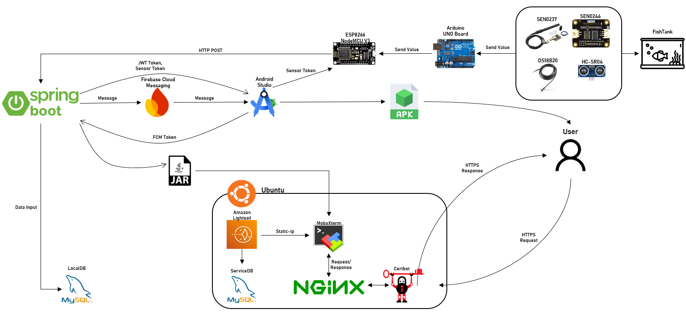

# 어항 관리 지원 서비스앱 README


## 프로젝트 소개
 - FishTankControlSystem은 물고기를 키울 때 변화하는 어항 환경을 하드웨어를 통해 모니터링하고 관리하여 키우는 물고기의 최상의 어항 환경을 유지할 수 있도록 돕는 어플리케이션입니다.
 - 본인이 키우는 어류를 직접 선택하고 해당 어류에 맞게 필요한 환경 변수들을 적절히 조절하여 최상의 어항 환경을 제공합니다.
 - 다양한 연령대가 접근하기 쉽게 귀여운 그림으로 인터페이스를 제공하고 호감도를 통해 본인의 물고기 캐릭터를 꾸밀 수 있습니다.
 - 데이터 통계를 통해 시간, 일, 주 단위로 어항의 환경 변화를 한눈으로 파악할 수 있게 제공합니다.
 - 사료 배식 시간 설정을 통해 자동으로 원하는 시간 단위로 물고기에게 사료를 배식할 수 있도록 설계되었습니다.

## 팀원 구성
<table>
  <tr>
    <th>임지성</th>
    <th>이승준</th>
    <th>유희수</th>
  </tr>
  <tr>
    <td align="center">
      <a href="https://github.com/ljsoung">@ljsoung</a>
    </td>
    <td align="center">
      <a href="https://github.com/SaMeL-dev">@SaMeL-dev</a>
    </td>
    <td align="center">
      <a href="https://github.com/Uhsoo02">@Uhsoo02</a>
    </td>
  </tr>
</table>

## 기술 스택
| 구분 | 기술 스택 |
|------|-----------|
| **언어** | Java(Spring Boot), Dart(Flutter), Python |
| **모바일 앱** | Flutter, HTTP 통신, Custom UI/Widget |
| **백엔드** | Spring Boot 3.5.7, JPA, Spring Security(JWT), Lombok, Gradle |
| **API 연동** | REST API(JSON), Postman 테스트 |
| **DB** | MySQL, JPA |
| **하드웨어(IoT)** | SEN0244(TDS), DS18B20(Temperature), SEN0237(DO), Arduino UNO Board, SG-90, HC-SR04, ESP8266 NodeMCU V3(WIFI Module) |
| **네트워크** | REST API, WIFI, HTTP JSON 데이터 송수신 |
| **시각화** | Flutter Charts |
| **보안** | JWT 토큰 인증, BCryptPasswordEncoder, Spring Security 필터 체인 |
| **IDE / Tool** | IntelliJ IDEA, Android Studio, GitHub, Postman |

## 시스템 아키텍쳐


## 프로젝트 구조
### 1. Backend
```
backend/
└── src
    ├── main
    │   ├── java
    │   │   └── com.iotbigdata.fishtankproject
    │   │       ├── config/
    |   |       |   ├── FirebaseConfig.java
    │   │       │   └── SecurityConfig.java
    │   │       │
    │   │       ├── controller/
    │   │       │   ├── FishController.java
    │   │       │   ├── SensorController.java
    │   │       │   ├── SensorTokenController.java
    │   │       │   └── UserController.java
    │   │       │
    │   │       ├── domain/
    │   │       │   ├── AppUser.java
    │   │       │   ├── Role.java
    │   │       │   ├── Fish.java
    │   │       │   ├── Likability.java
    │   │       │   ├── SensorEntity.java
    │   │       │   ├── SensorToken.java
    │   │       │   ├── DissolvedOxygen.java
    │   │       │   ├── WaterQuality.java
    │   │       │   └── WaterTemperature.java
    │   │       │
    │   │       ├── dto/
    │   │       │   ├── PasswordResetDto.java
    │   │       │   ├── SensorInputDto.java
    │   │       │   ├── UserLoginDto.java
    │   │       │   ├── UserRegisterDto.java
    │   │       │   └── VerifyUserDto.java
    │   │       │
    │   │       ├── repository/
    │   │       │   ├── UserRepository.java
    │   │       │   ├── FishRepository.java
    │   │       │   ├── LikabilityRepository.java
    │   │       │   ├── SensorTokenRepository.java
    │   │       │   ├── DissolvedOxygenRepository.java
    │   │       │   ├── WaterQualityRepository.java
    │   │       │   └── WaterTemperatureRepository.java
    │   │       │
    │   │       ├── security/
    │   │       │   ├── JwtAuthenticationFilter.java
    │   │       │   └── JwtTokenProvider.java
    │   │       │
    │   │       └── service/
    |   |           ├── FcmService.java
    │   │           ├── LoginService.java
    │   │           ├── UserService.java
    │   │           ├── FishService.java
    │   │           ├── LikabilityService.java
    │   │           ├── SensorService.java
    │   │           └── SensorTokenService.java
    │   │
    │   └── resources
    │       ├── application.properties
    │       └── application-test.properties
    │
    └── test
        └── InsertTestSensorData.java # 테스트 데이터 삽입
```
### 2. Flutter 모바일 앱 구조
```
flutter_app/
├── assets/
│   ├── decoration_image/
│   └── fish_species/
│
├── lib/
│   ├── screens/
│   │   ├── change_password/
│   │   │   ├── change_password_api.dart
│   │   │   └── change_password_screen.dart
│   │   │
│   │   ├── datagraph/
│   │   │   └── sensor_detail_screen.dart
│   │   │
│   │   ├── fish/
│   │   │   ├── decoration_sheet.dart
│   │   │   ├── feed_time_picker.dart
│   │   │   └── select_fish_species.dart 
│   │   │
│   │   ├── login/
│   │   │   ├── login_api.dart
│   │   │   └── login_screen.dart
│   │   │
│   │   ├── main/
│   │   │   └── main_screen.dart
│   │   │
│   │   ├── resetpw/
│   │   │   ├── reset_password_api.dart
│   │   │   └── reset_password_screen.dart
│   │   │
│   │   └── signup/
│   │       ├── signup_api.dart
│   │       └── signup_screen.dart
│   │
│   ├── utils/
│   │   ├── feed_timer_manager.dart
│   │   └── response_handler.dart
│   │
│   ├── widgets/
│   │   └── animated_fish.dart
│   │
│   └── main.dart
│
├── android/
├── ios/
├── linux/
├── macos/
├── windows/
└── pubspec.yaml
```
## 역할 분담
### 🐠 임지성
 - **Backend**
   - DB/JPA
   - 로그인/회원가입 기능(JWT 토큰 인증/BCryptPasswordEncoder) 구현
   - 어류별 적합 환경 조사
   - 센서 데이터 POST 요청 응답 로직 구현
   - 메인화면에 가장 최근 센서 데이터 전송
   - 센서 전용 토큰 기능 추가
   - 데이터 시각화를 위한 센서 데이터 필터링 및 전송
   - 호감도 구현
   - Postman을 통한 테스트
   - 각종 예외들에 대한 예외 처리
   - Firebase Cloud Messaging을 활용하여 사료 부족 시 앱에 알림 전송 구현
  
 - **App**
   - 각 기능에 Spring Boot와 JSON을 통한 요청 및 응답 구현
   - 사료 배식 시간 설정 기능 추가
   - 사용자가 선택한 어류를 안전하게 전달
   - 호감도 표시 UI 및 호감도에 따른 물고기 꾸미기 기능 구현
   - 앱 알림 기능 구현
   - APK 추출
  
### 🐟 이승준

### 🐡 유희수

## 개발 기간 및 작업 관리
### 개발 기간
 - 2025.09.01 ~ 2025.12.19

### 작업 관리
 - 카카오톡 등으로 TODO 리스트 정리하여 공유
 - Github로 코드 작성 후 Commit/Push하여 진행 상황 공유
 - 매일 1~2시간 가량 진도 체크 및 개발 진행

## 프로젝트 진행 중 이슈
TODO
## 앱 기능
TODO


